<samp><b>English</b> · <a href="README.pt-BR.md" lang="pt-BR">Português</a></samp>

<!-- assets/banner-*.svg are generated by scripts/build_assets.py: edit the script, not the SVG. -->

I'm an AI engineer working with language models in production. My focus is deterministic LLM programming, RAG, and automation that needs to hold up outside a demo.

I work as an AI engineer at Freedom.AI and run [MAIB](https://www.maib.com.br/en), where I do AI consulting and automation. In 2026, I won the Airbus Prize with the IGNITE team at the ActInSpace world final in Bordeaux, representing Brazil. I also placed second at AKCIT in 2025.

<samp><a href="https://www.maib.com.br/en">maib.com.br</a> · <a href="https://www.linkedin.com/in/renan-mocelin-br">linkedin</a> · <a href="mailto:renanryuakame@gmail.com">email</a></samp>

## <samp>Experience</samp>

<samp>2026-04 → present</samp> 
**AI Engineer** · Freedom.AI 
Conversational and autonomous agents with orchestration, memory, and tool use. End-to-end RAG pipelines, from ingestion to evaluation, with observability for quality, latency, cost, and safety.

<samp>2025-06 → 2026-06</samp> 
**AI Residency** · SENAI/SC 
Applied projects with industry partners in machine learning, computer vision, and generative AI, including a demand forecasting pipeline with 200+ features and temporal validation, and a RAG document copilot on AWS Bedrock.

<samp>2022-03 → 2025-06</samp> 
**Level 2 Support Analyst** · Paradigma Business Solutions 
Started as an intern. Investigated product issues directly in the database with T-SQL, triggers, and procedures, maintained XML and SOAP integrations, and shipped fixes through pull requests.

<samp>Education</samp>&nbsp; Postgraduate degree in Applied AI, SENAI/SC (2026) · BSc in Information Systems, Estácio (2024) · AWS Academy Data Engineering (2025)

## <samp>Projects</samp>

**[Prescriptive maintenance](https://github.com/HiRenan/senai-prescriptive-maintenance)** <samp>2026</samp> 
Turns measurements, maintenance history, and technical documents into a traceable answer for industrial assets: comparable cases, the evidence behind each suggested action, and abstention when the evidence is thin. 
<code>Python</code> <code>FastAPI</code> <code>pgvector</code> <code>RAG</code> <code>React</code> <code>Terraform</code>

**[IGNITE](https://github.com/HiRenan/ignite-team)** <samp>2026</samp> 
A satellite imagery project built for the "seeing the unseen, from space" challenge. It won the Airbus Prize at the ActInSpace 2026 world final in Bordeaux. [Live ↗](https://ignite-khaki-six.vercel.app) 
<code>React</code> <code>Vite</code> <code>JavaScript</code>

**[CortAI](https://github.com/HiRenan/CortAI)** <samp>2025</samp> 
A media agent that uses multimodal analysis of text, audio, and image to find the highlights in long videos and cut them into clips. Second place at AKCIT 2025. 
<code>Python</code> <code>FastAPI</code> <code>LangGraph</code> <code>Whisper</code> <code>React</code>

**[DevQuest](https://github.com/HiRenan/MAIBIA)** <samp>2026</samp> 
Three generative AI flows behind one API: career mentoring chat, résumé analysis, and GitHub repository review, with versioned prompts and typed tools. 
<code>Python</code> <code>FastAPI</code> <code>OpenAI</code> <code>TypeScript</code>

**[TinyML HAR](https://github.com/HiRenan/uci_har_tinyml)** <samp>2026</samp> 
Human activity recognition on an ESP32-S3: a small MLP trained on UCI HAR and quantized to int8, running entirely on the device. Simulated in Wokwi with an MPU6050, as a group project in the AI residency. 
<code>C</code> <code>Python</code> <code>ESP32-S3</code> <code>TinyML</code>

**[MaibPage](https://github.com/HiRenan/MaibPage)** <samp>2026</samp> 
The site behind maib.com.br, in PT and EN, with an MDX blog, a ⌘K palette, and a dark anti-neon design system in OKLCH checked by a WCAG contrast script. [Site ↗](https://www.maib.com.br/en) 
<code>Next.js</code> <code>TypeScript</code> <code>MDX</code> <code>Tailwind</code>

## <samp>Skills</samp>

<samp>GenAI</samp>&nbsp; Claude and GPT, agents, RAG, embeddings, memory, tool use, MCP, fine-tuning, evaluation, guardrails 
<samp>ML and MLOps</samp>&nbsp; Python, pandas, scikit-learn, forecasting, computer vision, MLflow 
<samp>Backend and cloud</samp>&nbsp; FastAPI, PostgreSQL, SQL and T-SQL, Docker, AWS and Bedrock, TypeScript, React, Node.js 
<samp>Tools</samp>&nbsp; Claude Code, Codex, Git

## <samp>Recent posts</samp>

<!-- BLOG-POST-LIST:START -->
- <samp>2026-07-21</samp>&nbsp; [How an AI coordinates my coding agents](https://www.maib.com.br/en/blog/ai-as-po)
- <samp>2026-06-30</samp>&nbsp; [How I check contrast in OKLCH](https://www.maib.com.br/en/blog/oklch-contrast)
- <samp>2026-06-30</samp>&nbsp; [How I check an agent&#39;s work](https://www.maib.com.br/en/blog/report-is-never-proof)

<!-- BLOG-POST-LIST:END -->

<samp><a href="https://www.maib.com.br/en/blog">View all posts →</a></samp>

## <samp>Contact</samp>

To talk about a MAIB project, reach me by [email](mailto:renanryuakame@gmail.com) or [LinkedIn](https://www.linkedin.com/in/renan-mocelin-br).
