<samp><a href="https://github.com/HiRenan" lang="en">English</a> · <b>Português</b></samp>

<!-- assets/banner-*.svg são gerados por scripts/build_assets.py: edite o script, não o SVG. -->

Sou engenheiro de IA e trabalho com modelos de linguagem em produção. Faço programação determinística de LLM, RAG e automações que precisam funcionar fora do demo.

Hoje trabalho como engenheiro de IA na Freedom.AI e toco a [MAIB](https://www.maib.com.br/pt), com consultoria e automação de IA. Em 2026, ganhei o Airbus Prize com a equipe IGNITE na final mundial do ActInSpace, em Bordeaux, representando o Brasil. Em 2025, fiquei em 2º lugar no AKCIT.

<samp><a href="https://www.maib.com.br/pt">maib.com.br</a> · <a href="https://www.linkedin.com/in/renan-mocelin-br">linkedin</a> · <a href="mailto:renanryuakame@gmail.com">email</a></samp>

## <samp>Experiência</samp>

<samp>2026-04 → presente</samp> 
**Engenheiro de IA** · Freedom.AI 
Agentes conversacionais e autônomos com orquestração, memória e uso de ferramentas. Pipelines de RAG de ponta a ponta, da ingestão à avaliação, com observabilidade de qualidade, latência, custo e segurança.

<samp>2025-06 → 2026-06</samp> 
**Residência em IA** · SENAI/SC 
Projetos aplicados com a indústria em machine learning, visão computacional e IA generativa, incluindo um pipeline de previsão de demanda com 200+ features e validação temporal, e um copiloto documental com RAG na AWS Bedrock.

<samp>2022-03 → 2025-06</samp> 
**Analista de Suporte N2** · Paradigma Business Solutions 
Comecei como estagiário. Investigava problemas direto no banco com T-SQL, triggers e procedures, cuidava de integrações XML e SOAP e enviava correções por pull request.

<samp>Educação</samp>&nbsp; Pós-graduação em IA Aplicada, SENAI/SC (2026) · Bacharelado em Sistemas de Informação, Estácio (2024) · AWS Academy Data Engineering (2025)

## <samp>Projetos</samp>

**[Manutenção prescritiva](https://github.com/HiRenan/senai-prescriptive-maintenance)** <samp>2026</samp> 
Transforma medições, histórico de manutenção e documentos técnicos em uma resposta rastreável para ativos industriais: casos comparáveis, a evidência por trás de cada ação sugerida e abstenção quando a evidência é fraca. 
<code>Python</code> <code>FastAPI</code> <code>pgvector</code> <code>RAG</code> <code>React</code> <code>Terraform</code>

**[IGNITE](https://github.com/HiRenan/ignite-team)** <samp>2026</samp> 
Projeto de imagens de satélite criado para o desafio "seeing the unseen, from space". Com ele, a equipe ganhou o Airbus Prize na final mundial do ActInSpace 2026, em Bordeaux. [Demo ↗](https://ignite-khaki-six.vercel.app) 
<code>React</code> <code>Vite</code> <code>JavaScript</code>

**[CortAI](https://github.com/HiRenan/CortAI)** <samp>2025</samp> 
Agente de mídia que usa análise multimodal de texto, áudio e imagem para achar os melhores momentos de vídeos longos e transformá-los em cortes. 2º lugar no AKCIT 2025. 
<code>Python</code> <code>FastAPI</code> <code>LangGraph</code> <code>Whisper</code> <code>React</code>

**[DevQuest](https://github.com/HiRenan/MAIBIA)** <samp>2026</samp> 
Três fluxos de IA generativa atrás de uma API: mentoria de carreira em chat, análise de currículo e revisão de repositório do GitHub, com prompts versionados e tools tipadas. 
<code>Python</code> <code>FastAPI</code> <code>OpenAI</code> <code>TypeScript</code>

**[TinyML HAR](https://github.com/HiRenan/uci_har_tinyml)** <samp>2026</samp> 
Reconhecimento de atividade humana no ESP32-S3: uma MLP pequena treinada no UCI HAR e quantizada em int8, rodando inteira no dispositivo. Simulado no Wokwi com um MPU6050, em projeto de grupo da residência em IA. 
<code>C</code> <code>Python</code> <code>ESP32-S3</code> <code>TinyML</code>

**[MaibPage](https://github.com/HiRenan/MaibPage)** <samp>2026</samp> 
O site do maib.com.br, em PT e EN, com blog em MDX, paleta ⌘K e um design system dark anti-neon em OKLCH conferido por um script de contraste WCAG. [Site ↗](https://www.maib.com.br/pt) 
<code>Next.js</code> <code>TypeScript</code> <code>MDX</code> <code>Tailwind</code>

## <samp>Tecnologias</samp>

<samp>IA generativa</samp>&nbsp; Claude e GPT, agentes, RAG, embeddings, memória, tool use, MCP, fine-tuning, avaliação, guardrails 
<samp>ML e MLOps</samp>&nbsp; Python, pandas, scikit-learn, forecasting, visão computacional, MLflow 
<samp>Backend e cloud</samp>&nbsp; FastAPI, PostgreSQL, SQL e T-SQL, Docker, AWS e Bedrock, TypeScript, React, Node.js 
<samp>Ferramentas</samp>&nbsp; Claude Code, Codex, Git

## <samp>Posts recentes</samp>

<!-- BLOG-POST-LIST:START -->
- <samp>2026-07-21</samp>&nbsp; [Como uma IA coordena meus agentes de código](https://www.maib.com.br/pt/blog/ai-as-po)
- <samp>2026-06-30</samp>&nbsp; [Como eu confiro contraste em OKLCH](https://www.maib.com.br/pt/blog/oklch-contrast)
- <samp>2026-06-30</samp>&nbsp; [Como eu confiro o trabalho de um agente](https://www.maib.com.br/pt/blog/report-is-never-proof)

<!-- BLOG-POST-LIST:END -->

<samp><a href="https://www.maib.com.br/pt/blog">Ver todos os posts →</a></samp>

## <samp>Contato</samp>

Pra conversar sobre um projeto da MAIB, me chama por [email](mailto:renanryuakame@gmail.com) ou [LinkedIn](https://www.linkedin.com/in/renan-mocelin-br).

